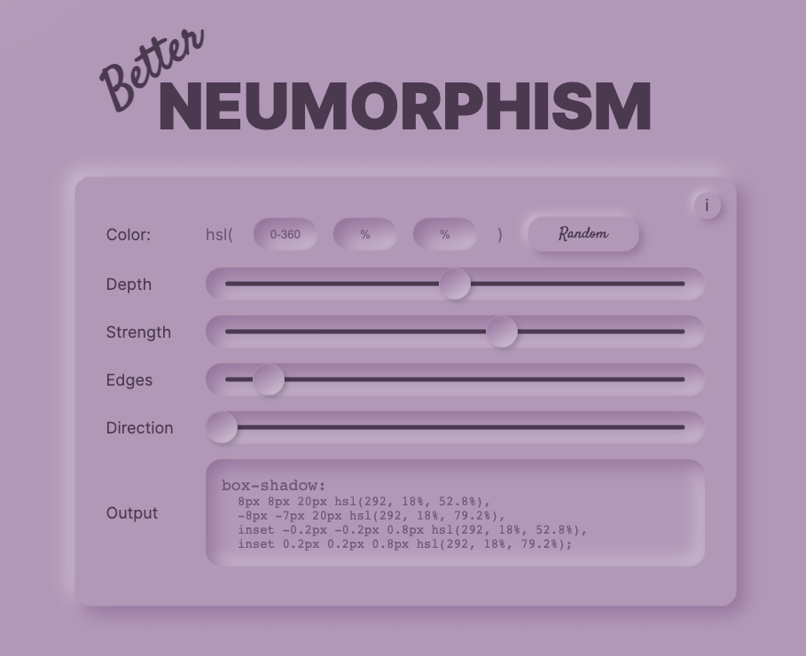

# Better Neumorphism 

This app was created as a design tool to improve upon other neumorphism generators by implementing 2 unique tactics:

- HSL implementation

Using HSL colors, instead of rgb or hex codes, allows interacting uniquely with the luminance of the color and provides a much more cohesive feeling to the effect on UI elements. Be sure to try luminance values between 50% and 90% for best results.

- Accommodation of rounded edges in UI elements

Coming from the 3D world I know that nothing has perfectly hard edges. Furthermore, adding the ability to control rounded edges, or ramp, gives designers more flexibility into the finer details of UI elements. The effect can be subtle...or extreme.

Beyond being a dev/design tool, this was also a study in this particular trend and effect and a chance for me to further my javascript knowledge.
I hope you like my take on neumorphism generators and find this tool useful.

Visit <a href="https://www.betterNeumorphism.com" >Better Neumorphism</a>

Check Out the <a href="https://codepen.io/drucial/pen/rNjJLWz">Codepen</a>
